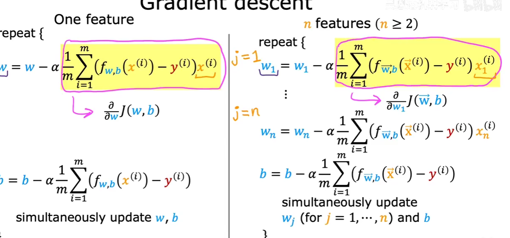

# 机器学习

## 机器学习算法

### **监督学习（Supervised Learning）**

#### 定义

提供输入和正确输出训练模型，使其能够仅通过输入来正确预测正确结果。y = f(x1, x2, ..., xn)

1. **回归（Regression）**：从连续值空间中预测一个具体数值
2. **分类（Classification）**：离散的有限的输出结果集合

#### 线性回归模型

- **成本函数**
- **梯度下降算法（Gradient Descent）**
  1. 同时更新所有参数
  2. 学习率 α 的选择（过大会导致不收敛，过小则收敛缓慢）

  **假设函数（Hypothesis）：**

  $$h_\theta(x) = \theta_0 + \theta_1 x_1 + \theta_2 x_2 + \cdots + \theta_n x_n$$

  **成本函数（Cost Function）：**

  $$J(\theta) = \frac{1}{2m} \sum_{i=1}^{m} \left( h_\theta(x^{(i)}) - y^{(i)} \right)^2$$

  **参数更新规则（Update Rule）：**

  $$\theta_j := \theta_j - \alpha \frac{\partial}{\partial \theta_j} J(\theta)$$

  展开为：

  $$\theta_j := \theta_j - \alpha \cdot \frac{1}{m} \sum_{i=1}^{m} \left( h_\theta(x^{(i)}) - y^{(i)} \right) x_j^{(i)}$$

  其中：
  - $m$：训练样本数量
  - $\alpha$：学习率（learning rate）
  - $x_j^{(i)}$：第 $i$ 个样本的第 $j$ 个特征值

  **伪代码实现：**

  ```
  输入：训练集 {(x⁽¹⁾, y⁽¹⁾), (x⁽²⁾, y⁽²⁾), ..., (x⁽ᵐ⁾, y⁽ᵐ⁾)}
        学习率 α，收敛阈值 ε，最大迭代次数 T

  // 1. 初始化参数
  令 θ₀, θ₁, ..., θₙ = 0（或随机小值）
  J_prev = ∞

  // 2. 迭代更新
  FOR t = 1, 2, ..., T DO:
      // 2.1 计算当前代价函数值
      J(θ) = (1 / 2m) * Σᵢ₌₁ᵐ (h_θ(x⁽ⁱ⁾) - y⁽ⁱ⁾)²

      // 2.2 同时更新所有参数 θⱼ (j = 0, 1, ..., n)
      tempⱼ = θⱼ - α * (1/m) * Σᵢ₌₁ᵐ (h_θ(x⁽ⁱ⁾) - y⁽ⁱ⁾) * xⱼ⁽ⁱ⁾
      // 注意：所有 θⱼ 必须同时更新
      FOR j = 0, 1, ..., n DO:
          θⱼ = tempⱼ

      // 2.3 收敛检查
      IF |J_prev - J(θ)| < ε THEN:
          BREAK  // 代价函数变化量小于阈值，已收敛
      J_prev = J(θ)

  // 3. 返回结果
  输出：参数 θ₀, θ₁, ..., θₙ
  ```

  > **收敛条件说明：**
  > - 当代价函数的变化量 $|J_{prev} - J(\theta)| < \varepsilon$ 时，认为算法已收敛
  > - $\varepsilon$ 通常取 $10^{-6}$ 到 $10^{-3}$ 之间
  > - 设置最大迭代次数 $T$ 防止无限循环

- **Adam 算法（Adaptive Moment Estimation）**

  自适应学习率优化算法，结合了 Momentum 和 RMSProp 的优点，为每个参数维护独立的自适应学习率。

  **核心思想：**
  - 一阶矩估计（均值）：$m_t = \beta_1 m_{t-1} + (1 - \beta_1) g_t$
  - 二阶矩估计（未中心化的方差）：$v_t = \beta_2 v_{t-1} + (1 - \beta_2) g_t^2$
  - 偏差修正：$\hat{m}_t = \frac{m_t}{1 - \beta_1^t}$，$\hat{v}_t = \frac{v_t}{1 - \beta_2^t}$
  - 参数更新：$\theta_j := \theta_j - \alpha \cdot \frac{\hat{m}_t}{\sqrt{\hat{v}_t} + \epsilon}$

  其中：
  - $g_t$：当前梯度
  - $\beta_1$：一阶矩衰减率，通常取 0.9
  - $\beta_2$：二阶矩衰减率，通常取 0.999
  - $\epsilon$：防止除零的小常数，通常取 $10^{-8}$

- **多元线性回归**



- **特征缩放（Feature Scaling）**：将不同特征的值缩放到相近的范围（如 0 ≤ x ≤ 1），使梯度下降更快收敛
- **均值归一化**：
- **特征工程（Feature Engineering）**：通过直觉设计新特征，对原始特征进行变换或组合。

#### 逻辑回归（Logistic Regression）

用于分类问题的算法，输出值为 0 或 1。

**Sigmoid 函数：**

$$g(z) = \frac{1}{1 + e^{-z}}$$

**假设函数：**

$$h_\theta(x) = g(\theta^T x) = \frac{1}{1 + e^{-\theta^T x}}$$

**决策边界（Decision Boundary）：**

- 当 $h_\theta(x) \geq 0.5$ 时，预测 $y = 1$
- 当 $h_\theta(x) < 0.5$ 时，预测 $y = 0$

**逻辑回归损失函数（Cost Function）：**

$$J(\theta) = -\frac{1}{m} \sum_{i=1}^{m} \left[ y^{(i)} \log h_\theta(x^{(i)}) + (1 - y^{(i)}) \log \left(1 - h_\theta(x^{(i)})\right) \right]$$

**参数更新规则：**

$$\theta_j := \theta_j - \alpha \cdot \frac{1}{m} \sum_{i=1}^{m} \left( h_\theta(x^{(i)}) - y^{(i)} \right) x_j^{(i)}$$

#### 正则化（Regularization）

解决过拟合问题，通过惩罚较大的参数值来简化模型。

**正则化代价函数（线性回归）：**

$$J(\theta) = \frac{1}{2m} \left[ \sum_{i=1}^{m} \left( h_\theta(x^{(i)}) - y^{(i)} \right)^2 + \lambda \sum_{j=1}^{n} \theta_j^2 \right]$$

**正则化代价函数（逻辑回归）：**

$$J(\theta) = -\frac{1}{m} \sum_{i=1}^{m} \left[ y^{(i)} \log h_\theta(x^{(i)}) + (1 - y^{(i)}) \log \left(1 - h_\theta(x^{(i)})\right) \right] + \frac{\lambda}{2m} \sum_{j=1}^{n} \theta_j^2$$

其中：
- $\lambda$：正则化参数，控制惩罚力度
- $\lambda$ 过大 → 欠拟合；$\lambda$ 过小 → 过拟合

#### 支持向量机（SVM）

通过寻找最优超平面将不同类别的数据分开，核心思想是**最大化分类间隔**。

**关键概念：**

- **超平面（Hyperplane）**：$w^T x + b = 0$，决策边界
- **支持向量（Support Vectors）**：距离超平面最近的样本点，决定超平面位置
- **间隔（Margin）**：支持向量到超平面的距离，SVM 的目标是最大化这个距离

**优化目标：**

$$\min_{w, b} \frac{1}{2} \| w \|^2 \quad \text{s.t.} \quad y^{(i)}(w^T x^{(i)} + b) \geq 1$$

**核函数（Kernel Function）：**

当数据线性不可分时，通过核函数将数据映射到高维空间使其线性可分，无需显式计算高维坐标。

| 核函数 | 公式 | 特点 |
|------|------|------|
| 线性核 | $K(x, z) = x^T z$ | 适合线性可分数据 |
| 多项式核 | $K(x, z) = (x^T z + c)^d$ | 可学习非线性边界 |
| 高斯核（RBF） | $K(x, z) = \exp(-\frac{\|x - z\|^2}{2\sigma^2})$ | 最常用，适合大多数场景 |

**软间隔与正则化：**

引入松弛变量 $\xi_i$ 允许部分样本违反间隔约束，等价于正则化：

$$\min_{w, b} \frac{1}{2} \| w \|^2 + C \sum_{i=1}^{m} \xi_i$$

- $C$ 大 → 不允许误分类，可能过拟合
- $C$ 小 → 允许更多误分类，泛化更好

**典型应用：** 文本分类、图像分类、生物信息学（小样本高维数据表现优异）

#### 决策树（Decision Tree）

通过一系列 if-else 规则对数据进行划分，形似一棵倒置的树。

**核心概念：**

- **根节点（Root Node）**：包含全部训练数据，进行第一次划分
- **内部节点（Internal Node）**：对一个特征进行测试，划分数据
- **叶节点（Leaf Node）**：输出预测结果（分类类别或回归值）

**划分标准 —— 信息增益：**

**信息熵（Entropy）：** 衡量数据集的纯度

$$H(S) = -\sum_{k=1}^{K} p_k \log_2 p_k$$

**信息增益（Information Gain）：** 划分前后信息熵的减少量

$$\text{Gain}(S, A) = H(S) - \sum_{v} \frac{|S_v|}{|S|} H(S_v)$$

选择信息增益最大的特征进行划分。

**基尼不纯度（Gini Impurity）：**

$$\text{Gini}(S) = 1 - \sum_{k=1}^{K} p_k^2$$

- CART 算法默认使用基尼不纯度，计算更高效
- 基尼值越小，纯度越高

**剪枝（Pruning）：** 防止过拟合

- **预剪枝（Pre-pruning）**：建树过程中提前停止（限制深度、最小样本数等）
- **后剪枝（Post-pruning）**：先建完整树，再自底向上合并叶节点

**典型算法：** ID3（信息增益）、C4.5（信息增益比）、CART（基尼不纯度）

**优缺点：**

- **优点**：可解释性强，无需特征缩放，能处理非线性关系
- **缺点**：容易过拟合，对数据扰动敏感（高方差）

#### 集成学习（Ensemble Learning）

将多个弱学习器组合成一个强学习器，通常比单一模型表现更好。

**三大范式：**

**1. Bagging（Bootstrap Aggregating）**

- 有放回地抽样生成多个训练集，分别训练基学习器，最终投票/平均
- 核心目标：**降低方差**（减少过拟合）
- 代表算法：**随机森林（Random Forest）**

**随机森林：**

- 每棵树使用 Bootstrap 样本 + 随机选择部分特征
- 分类任务：多数投票；回归任务：取平均
- 优点：抗过拟合、能评估特征重要性、并行训练

**2. Boosting**

- 串行训练多个学习器，每个新学习器关注前一个学习器分错的样本
- 核心目标：**降低偏差**（提升模型能力）
- 代表算法：**AdaBoost**、**Gradient Boosting**

**AdaBoost 核心思想：**

- 初始时所有样本权重相等
- 每轮训练后，增大分错样本的权重，减小分对样本的权重
- 最终加权投票

**3. 梯度提升（Gradient Boosting）**

- 每一轮新学习器拟合当前模型的**残差**（负梯度方向）
- 代表算法：**XGBoost**、**LightGBM**、**CatBoost**

**XGBoost 关键特性：**

- 二阶泰勒展开近似目标函数
- 正则化项控制模型复杂度
- 支持列抽样（类似随机森林）
- 自动处理缺失值

**典型应用：** 结构化/表格数据任务的首选，Kaggle 竞赛中占绝对主导地位

#### 卷积神经网络（CNN）

一种专门用于处理具有网格结构数据（如图像）的神经网络。

**卷积层（Convolutional Layer）：**

- 使用一组可学习的**滤波器（Filter / Kernel）** 在输入上滑动，计算滤波器与输入局部区域的点积
- 保留空间结构信息，同时通过**权重共享**大幅减少参数量
- 每个滤波器可以检测特定的局部特征（如边缘、纹理、角点）

**卷积输出尺寸计算：**

$$\text{output size} = \lfloor \frac{n + 2p - f}{s} \rfloor + 1$$

其中：
- $n$：输入尺寸
- $f$：滤波器尺寸
- $p$：填充（Padding）大小
- $s$：步长（Stride）

**池化层（Pooling Layer）：**

- 降低特征图的空间尺寸，减少计算量
- 增强对平移的不变性
- 常见类型：最大池化（Max Pooling）、平均池化（Average Pooling）

**典型结构：** 输入 → 卷积层 → 激活函数 → 池化层 → ... → 全连接层 → 输出

### **无监督学习（Unsupervised Learning）**

#### 定义

训练数据没有标注的输出结果，模型自动从数据中发现隐藏的结构和模式。常见任务包括聚类、降维和密度估计等。

#### K-Means 聚类算法

1. 随机初始化 $K$ 个聚类中心 $\mu_1, \mu_2, \ldots, \mu_K$
2. 重复以下步骤直到收敛：
   - **簇分配**：将每个样本分配到最近的聚类中心
   - **移动中心**：将聚类中心更新为该簇所有样本的均值

**目标函数（Distortion）：**

$$J = \frac{1}{m} \sum_{i=1}^{m} \| x^{(i)} - \mu_{c^{(i)}} \|^2$$

#### 降维（Dimensionality Reduction）

- **主成分分析（PCA）**：将高维数据投影到低维子空间，保留最大方差信息
- 应用场景：数据压缩、可视化、加速学习算法

### **强化学习（Reinforcement Learning）**

#### 定义

智能体（Agent）通过与环境（Environment）交互，根据奖励（Reward）信号学习最优策略（Policy）。

#### 核心概念

- **状态（State）**：环境的当前情况
- **动作（Action）**：智能体可以执行的操作
- **奖励（Reward）**：环境对智能体动作的反馈信号
- **策略（Policy）**：状态到动作的映射规则

#### 典型应用

- 游戏 AI（如 AlphaGo）
- 机器人控制
- 自动驾驶

#### 马尔可夫决策过程（MDP）

MDP 是强化学习的数学框架，用于建模智能体在环境中做决策的过程。

**核心要素：**

| 符号 | 含义 | 说明 |
|------|------|------|
| $S$ | 状态空间 | 环境中所有可能状态的集合 |
| $A$ | 动作空间 | 智能体可执行的所有动作 |
| $P(s' \mid s, a)$ | 状态转移概率 | 在状态 $s$ 执行动作 $a$ 后转移到 $s'$ 的概率 |
| $R(s, a)$ | 奖励函数 | 在状态 $s$ 执行动作 $a$ 获得的即时奖励 |
| $\gamma$ | 折扣因子 | $\gamma \in [0, 1]$，衡量未来奖励的重要性 |

**马尔可夫性质：** 未来状态仅依赖于当前状态和动作，与历史无关。

**目标：** 找到最优策略 $\pi^*$，使累计折扣奖励最大化：

$$G_t = R_{t+1} + \gamma R_{t+2} + \gamma^2 R_{t+3} + \cdots = \sum_{k=0}^{\infty} \gamma^k R_{t+k+1}$$

#### Bellman 方程

Bellman 方程是 MDP 的递归分解，将长期回报拆分为「即时奖励 + 未来回报」。

**状态价值函数：**

$$V^\pi(s) = \mathbb{E}_\pi \left[ G_t \mid S_t = s \right] = \mathbb{E}_\pi \left[ R_{t+1} + \gamma V^\pi(S_{t+1}) \mid S_t = s \right]$$

展开为：

$$V^\pi(s) = \sum_a \pi(a \mid s) \sum_{s', r} p(s', r \mid s, a) \left[ r + \gamma V^\pi(s') \right]$$

**动作价值函数（Q 函数）：**

$$Q^\pi(s, a) = \mathbb{E}_\pi \left[ R_{t+1} + \gamma V^\pi(S_{t+1}) \mid S_t = s, A_t = a \right]$$

**Bellman 最优方程：**

$$V^*(s) = \max_a \sum_{s', r} p(s', r \mid s, a) \left[ r + \gamma V^*(s') \right]$$

$$Q^*(s, a) = \sum_{s', r} p(s', r \mid s, a) \left[ r + \gamma \max_{a'} Q^*(s', a') \right]$$

最优策略：

$$\pi^*(s) = \arg\max_a Q^*(s, a)$$

## 模型评估与选择

### 偏差-方差权衡（Bias-Variance Tradeoff）

模型泛化误差可分解为三个部分：

$$\text{泛化误差} = \text{偏差}^2 + \text{方差} + \text{不可约误差}$$

| | 高偏差（欠拟合） | 高方差（过拟合） |
|------|------|------|
| **训练误差** | 高 | 低 |
| **验证误差** | 高 | 远高于训练误差 |
| **原因** | 模型太简单，无法捕捉数据规律 | 模型太复杂，记住了训练数据的噪声 |
| **解决方法** | 增加特征、使用更复杂模型、减少正则化 | 增加数据、正则化、简化模型 |

**核心洞察：** 偏差和方差此消彼长，需要找到平衡点使泛化误差最小。

### 过拟合与欠拟合

- **欠拟合（Underfitting）**：模型过于简单，无法捕捉数据规律（高偏差）
- **过拟合（Overfitting）**：模型过于复杂，过度拟合训练数据（高方差）

### 数据划分与交叉验证

- 将数据集划分为训练集、验证集、测试集
- 常用比例：60% 训练 / 20% 验证 / 20% 测试
- **K 折交叉验证（K-Fold Cross Validation）**：将训练集平均分成 K 份，每次取其中 1 份作为验证集、其余 K-1 份作为训练集，重复 K 次后取平均性能作为最终评估结果，有效减少评估的方差

### 评估指标

- **准确率（Accuracy）**：分类正确的样本占总样本的比例
- **精确率（Precision）**：预测为正例中真正为正例的比例
- **召回率（Recall）**：真正为正例中被正确预测的比例
- **F1 分数**：精确率和召回率的调和平均

$$F_1 = \frac{2 \cdot P \cdot R}{P + R}$$

### 评估模型的表现

#### 基线标准（Baseline）

在评估模型之前，先确定一个参考标准，用于判断模型表现是否足够好：

- **人类水平（Human-level Performance）**：以人类在该任务上的表现为基准
- **同类算法表现**：参考同类型算法在相同数据集上的结果
- **已有系统表现**：对比当前生产环境中已有系统的性能

> **意义：** 基线标准帮助你快速判断应该优先解决高偏差还是高方差问题。
> - 模型表现低于基线 → 存在**高偏差**（欠拟合），需提升模型能力
> - 模型表现接近基线但泛化差 → 存在**高方差**（过拟合），需正则化或更多数据

#### 学习曲线（Learning Curves）

绘制训练误差和验证误差随训练数据量或训练轮次的变化趋势，用于诊断模型问题。

**误差随数据量变化：**

- **高偏差（欠拟合）：** 训练误差和验证误差都较高，且随数据量增加趋于接近但仍在高位。增加数据量帮助不大，需要改进模型本身。
- **高方差（过拟合）：** 训练误差较低，但验证误差远高于训练误差，两者之间存在较大间隙。增加数据量可以缩小间隙。

**误差随训练轮次变化：**

- 训练误差随轮次增加持续下降
- 验证误差先下降后可能上升（过拟合的征兆）
- 当验证误差开始上升时，应停止训练（Early Stopping）

## 聚类算法（Clustering Algorithms）

### K-Means（K 均值聚类）

#### 算法流程

1. 随机初始化 $K$ 个聚类中心 $\mu_1, \mu_2, \ldots, \mu_K$
2. 重复以下步骤直到收敛：
   - **簇分配（Cluster Assignment）**：对每个样本 $x^{(i)}$，计算其到各聚类中心的距离，将其分配到最近的簇
     $$c^{(i)} := \arg\min_k \| x^{(i)} - \mu_k \|^2$$
   - **移动中心（Move Centroid）**：将每个聚类中心更新为该簇所有样本的均值
     $$\mu_k := \frac{1}{|C_k|} \sum_{x \in C_k} x$$

#### 目标函数（Distortion Function）

$$J = \frac{1}{m} \sum_{i=1}^{m} \| x^{(i)} - \mu_{c^{(i)}} \|^2$$

- K-Means 保证 $J$ 单调递减，最终收敛
- $J$ 是非凸函数，可能陷入局部最优

#### K 值选择 —— 肘部法则（Elbow Method）

- 绘制 $J$ 随 $K$ 变化的曲线
- 选择曲线出现"肘部"（下降速度明显变缓）处的 $K$ 值
- 实际应用中还需结合业务需求和轮廓系数等指标综合判断

#### 初始化方法

- **随机初始化**：随机选取 $K$ 个样本作为初始中心，多次运行取最优
- **K-Means++**：第一个中心随机选取，后续中心以概率 $\propto D(x)^2$ 选取（$D(x)$ 为样本到最近中心的距离），使初始中心尽量分散，显著改善收敛质量和速度

#### 优缺点

- **优点**：原理简单，收敛速度快，适合大规模数据
- **缺点**：需预设 $K$ 值；对初始值敏感；对异常值敏感；不适合非凸形状的簇

---

### DBSCAN（基于密度的空间聚类）

#### 核心思想

通过样本的**密度可达性**发现任意形状的簇，无需预设簇数。

#### 关键参数

- **$\varepsilon$（eps）**：邻域半径
- **$MinPts$**：邻域内最少样本数

#### 样本分类

- **核心点（Core Point）**：$\varepsilon$ 邻域内样本数 $\geq MinPts$
- **边界点（Border Point）**：$\varepsilon$ 邻域内样本数 $< MinPts$，但位于某个核心点的邻域内
- **噪声点（Noise Point）**：既不是核心点，也不是边界点

#### 聚类过程

1. 将所有样本标记为未访问
2. 随机选取一个未访问的核心点 $p$，创建一个新簇 $C$
3. 对 $p$ 的 $\varepsilon$ 邻域内每个样本 $q$：
   - 若 $q$ 也是核心点，将其邻域内所有样本加入 $C$
   - 递归扩展，直到簇不再增长
4. 重复上述过程，直到所有样本被访问

#### 优缺点

- **优点**：无需预设簇数；能发现任意形状的簇；能识别噪声点（离群点）
- **缺点**：对参数 $\varepsilon$ 和 $MinPts$ 敏感；不适合密度差异很大的数据集；高维数据效果下降

---

### 层次聚类（Hierarchical Clustering）

#### 基本思想

通过逐步合并（凝聚式）或逐步分裂（分裂式）构建一棵聚类树（Dendrogram），无需预设簇数。

#### 凝聚式层次聚类（Agglomerative）流程

1. 将每个样本视为一个单独的簇
2. 计算所有簇之间的距离，合并距离最近的两个簇
3. 重复步骤 2，直到所有样本合并为一个大簇或达到停止条件

#### 簇间距离度量（Linkage Criteria）

| 方法 | 定义 | 特点 |
|------|------|------|
| **单连接（Single Linkage）** | 两簇中最近样本的距离 | 能发现非球形簇，但易产生链式效应 |
| **全连接（Complete Linkage）** | 两簇中最远样本的距离 | 倾向于生成紧凑的球形簇 |
| **平均连接（Average Linkage）** | 两簇所有样本对的平均距离 | 单连接和全连接的折中 |
| **Ward 法** | 合并后使簇内方差增量最小的两个簇 | 效果通常最好，类似 K-Means 的目标 |

#### 优缺点

- **优点**：无需预设簇数；生成树状图，直观展示数据的层次结构
- **缺点**：时间复杂度 $O(n^3)$（朴素实现），不适合大规模数据；一旦合并/分裂不可回退

---

### 聚类算法对比

| 特性 | K-Means | DBSCAN | 层次聚类 |
|------|---------|--------|----------|
| 需预设簇数 | 是 | 否 | 否 |
| 簇形状 | 球形 | 任意形状 | 取决于 Linkage |
| 噪声处理 | 不敏感 | 能识别噪声 | 不敏感 |
| 时间复杂度 | $O(n \cdot K \cdot T)$ | $O(n^2)$（朴素） | $O(n^3)$（朴素） |
| 适用场景 | 大规模、球形簇 | 密度不均、有噪声 | 小规模、需层次结构 |

---

### 聚类评估指标

#### 轮廓系数（Silhouette Coefficient）

衡量样本与自身簇的紧密度和与其他簇的分离度：

$$s(i) = \frac{b(i) - a(i)}{\max\{a(i), b(i)\}}$$

其中：
- $a(i)$：样本 $i$ 到同簇其他样本的平均距离（簇内紧密度）
- $b(i)$：样本 $i$ 到最近其他簇所有样本的平均距离（簇间分离度）

- $s(i) \in [-1, 1]$，越接近 1 表示聚类效果越好
- $s(i) < 0$ 表示样本可能被分配到了错误的簇

#### 其他评估指标

- **Calinski-Harabasz 指数**：簇间方差与簇内方差的比值，越大越好
- **Davies-Bouldin 指数**：簇间相似度度量，越小越好


### 待补充主题

- 异常检测算法（与监督学习的区别、应用场景）
- 推荐系统：协同过滤、基于内容过滤、冷启动问题
